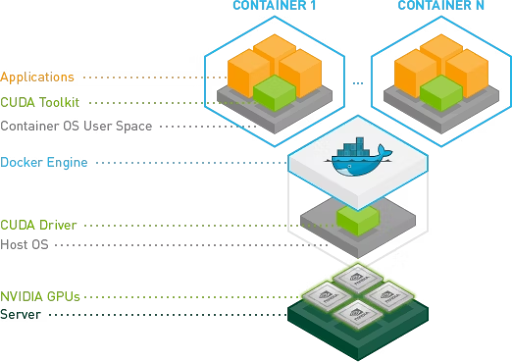
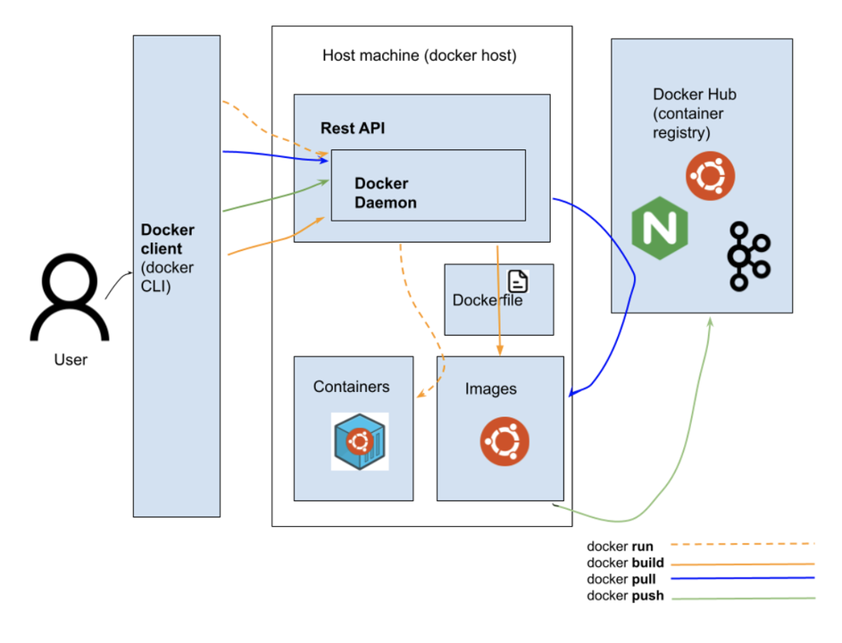
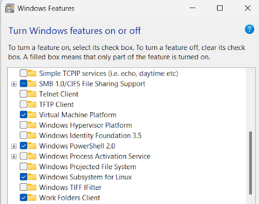
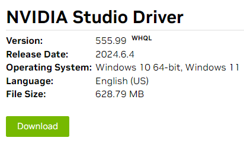
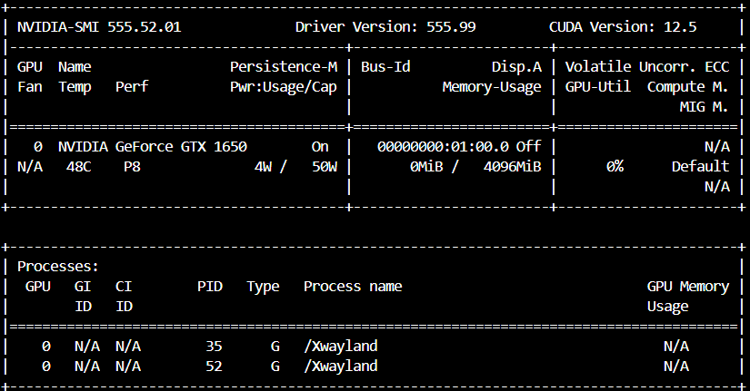

# Overview

I struggled quite a bit to set up a local PC environment for deep learning that could be used for Kaggle, so I'm summarizing the process here as a record.

# Prerequisites

- Hardware
  - CPU: Intel(R) Core(TM) i7-10750H CPU
    - Memory: 16GB
  - GPU: NVIDIA GeForce GTX 1650
    - Memory: 12GB
- OS
  - Default: Windows 11 Home 64bit
  - **Linux: WSL2**
  - **Linux distribution: Ubuntu**
    - Version: 22.04
  - **NVIDIA CUDA (Compute Unified Device Architecture) Driver**
- Applications
  - **Docker Engine**
  - **Nvidia Container Toolkit (CUDA toolkit)**

## Components to Install



- **WSL2**: Necessary to run Docker
- **Ubuntu**: Linux distribution
- **NVIDIA CUDA (Compute Unified Device Architecture) Driver**: Low-level software that utilizes GPU's parallel processing capabilities to achieve high-performance computing, providing an interface between GPU and applications. You need to install a specific version for your GPU.
- **Docker Engine**: Open-source containerization technology for building and containerizing applications. It consists of the Docker client (Docker CLI), REST API, and Docker daemon. The Docker client interacts with the REST API via the UNIX domain socket `/var/run/docker.sock`, and the Docker daemon performs actual container operations and image builds.
    
    
    
- **NVIDIA Container Toolkit (CUDA toolkit)**: Software package that provides high-level development tools and libraries for developing CUDA applications. Necessary for TensorFlow and PyTorch to use GPU.

# Setup Procedure

1. Cleanup (if previously installed)
    1. "Control Panel" → "Programs" → "Uninstall a program"
    2. "Settings" → "Apps" → "Apps & features" ★Recommended for Windows 10 and later
        1. [**WSL2 Installation and Uninstallation**](https://qiita.com/zakoken/items/61141df6aeae9e3f8e36)
2. Enable WSL2 on Windows
    1. "Control Panel" → "Programs" → "Turn Windows features on or off"
    2. Check "Windows Subsystem for Linux" and "Virtual Machine Platform", then click OK
        
        
        
3. Install **WSL2 and Ubuntu**
    1. Install WSL and Ubuntu from the command prompt
        
        ```bash
        wsl --install
        ```
        
    2. Create username and password
4. Install **Nvidia driver for Windows** from the following site depending on your GPU spec
    1. https://www.nvidia.com/download/index.aspx
        1. Select your GPU product name and version
        2. Choose **"Studio Drivers"** as the Download Type
        
        
        
    2. Run the installer
        1. Follow the installation steps referring to the following site:
            1. [**GeForce Experience driver installation failed. How do I manually clean install the NVIDIA driver for my graphics card?**](https://nvidia.custhelp.com/app/answers/detail/a_id/10/related/1)
5. Install **Docker** on WSL or Windows referring to the following site
    1. [**Docker Desktop WSL 2 backend on Windows**](https://docs.docker.com/desktop/wsl/#download)
    2. It's better to install Docker Desktop for Windows using the GUI on Windows.
        1. Reasons:
            1. Docker Desktop integration allows you to use GPU without complex configurations.
            2. Docker Desktop has official support for using NVIDIA GPU through WSL 2 integration.
6. Install **Nvidia Container Toolkit** on WSL
    1. Get distribution and version information
    2. Download and save the GPG key converted to binary format using gpg --dearmor
    3. Download and configure the libnvidia-container repository list, use sed to specify that the repository URL is signed with the GPG key saved in step 5-2, and save using sudo tee.
        
        ```bash
        distribution=$(. /etc/os-release;echo $ID$VERSION_ID) \
              && curl -fsSL https://nvidia.github.io/libnvidia-container/gpgkey | sudo gpg --dearmor -o /usr/share/keyrings/nvidia-container-toolkit-keyring.gpg \
              && curl -s -L https://nvidia.github.io/libnvidia-container/$distribution/libnvidia-container.list | \
                    sed 's#deb https://#deb [signed-by=/usr/share/keyrings/nvidia-container-toolkit-keyring.gpg] https://#g' | \
                    sudo tee /etc/apt/sources.list.d/nvidia-container-toolkit.list
        ```
        
    4. Install nvidia-container-toolkit and check if the GPU can be read from the container. If you see an image like the following, it's successful.
    
    ```bash
    sudo apt-get update
    sudo apt-get install -y nvidia-container-toolkit
    sudo docker run --rm --gpus all nvidia/cuda:11.6.2-base-ubuntu20.04 nvidia-smi
    ```
    
    
    
7. Start Docker daemon
    1. Configure Docker daemon to recognize NVIDIA container runtime using CUDA toolkit
    
    ```bash
    sudo nvidia-ctk runtime configure --runtime=docker
    sudo systemctl restart docker
    ```
    
8. Start the container for the execution environment
    1. Create the following docker-compose.yml file in any directory. This not only starts the container but also installs Python and necessary libraries.
        
        ```yaml
        version: '3.8'
        services:
          pytorch-jupyter:
            image: nvidia/cuda:11.8.0-cudnn8-devel-ubuntu22.04
            container_name: pytorch-jupyter
            deploy:
              resources:
                reservations:
                  devices:
                    - capabilities: [gpu]
            environment:
              - NVIDIA_VISIBLE_DEVICES=all
              - NVIDIA_DRIVER_CAPABILITIES=compute,utility
            command: >
              /bin/bash -c "apt-get update && apt-get install -y python3 python3-pip &&
              pip install torch torchvision torchaudio --index-url https://download.pytorch.org/whl/cu118 &&
              pip install jupyterlab &&
              jupyter lab --ip='*' --port=8888 --no-browser --allow-root --NotebookApp.token='' --NotebookApp.password=''"
            ports:
              - "8888:8888"
            volumes:
              - ./target:/workspace
            working_dir: /workspace
        ```
        
    2. Start the container using docker compose
        
        ```bash
        docker compose up
        ```
        
    3. Open Jupyter in your browser and check if the GPU is accessible.
        
        ```python
        import torch
        import torch.cuda as cuda
        
        # Check if GPU is available
        if torch.cuda.is_available():
            print(f"CUDA is available. GPU name: {torch.cuda.get_device_name(0)}")
            
            # Get the device (GPU) properties
            device = torch.device("cuda")
            
            # Get current GPU memory usage
            total_memory = torch.cuda.get_device_properties(device).total_memory
            reserved_memory = torch.cuda.memory_reserved(device)
            allocated_memory = torch.cuda.memory_allocated(device)
            free_memory = reserved_memory - allocated_memory
            
            print(f"Total GPU memory: {total_memory / 1e9:.2f} GB")
            print(f"Reserved GPU memory: {reserved_memory / 1e9:.2f} GB")
            print(f"Allocated GPU memory: {allocated_memory / 1e9:.2f} GB")
            print(f"Free GPU memory: {free_memory / 1e9:.2f} GB")
            
        else:
            print("CUDA is not available. Running on CPU.")
        ```
